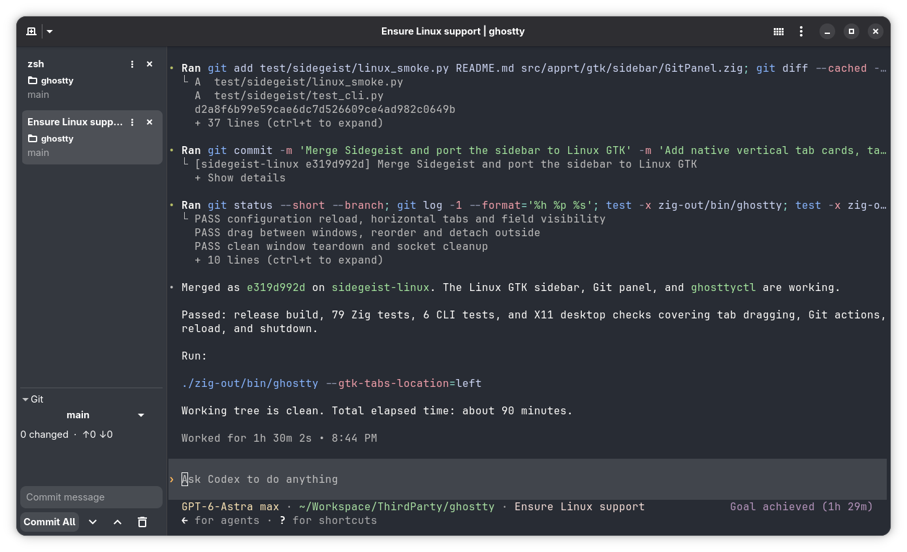

# Ghostty Sidegeist for Linux

A personal [Ghostty](https://github.com/ghostty-org/ghostty) fork that brings
[Sidegeist](https://github.com/tomreinert/ghostty-sidegeist)'s sidebar and Git
panel to Linux with a native GTK implementation.

Built for personal use on Linux. The imported macOS changes are untested.



## Features

- **Vertical tabs:** cards show the title, working directory, Git branch, custom
  status entries, and attention indicators for notifications or bells.
- **Tab organization:** rename and color tabs, drag to reorder, move between
  windows, or drop outside the sidebar to open a new window.
- **Resizable sidebar:** drag the divider to adjust its width. Colors follow
  your terminal theme, and normal tab shortcuts and splits still work.
- **Git panel:** inspect changes, switch local branches, open files, commit,
  push, pull, and discard changes with confirmation.
- **CLI control:** use `ghosttyctl` to name tabs, set status entries and colors,
  and send notifications from scripts or terminal tools.

## Build and run

Using the repository's Nix development environment:

```sh
nix develop --command zig build -Doptimize=ReleaseFast
./zig-out/bin/ghostty --gtk-tabs-location=left
```

On other Linux distributions, install Ghostty's GTK build dependencies and
Zig 0.16.0, then build with:

```sh
zig build -Doptimize=ReleaseFast
./zig-out/bin/ghostty --gtk-tabs-location=left
```

Git must be on `PATH` for branch labels and the Git panel. The build also
installs `zig-out/bin/ghosttyctl`, which requires Python 3. See
[HACKING.md](HACKING.md) for the upstream development guide.

## Configuration

The sidebar is enabled by default. These settings can go in your Ghostty
config, normally `~/.config/ghostty/config`:

```ini
gtk-tabs-location = left
sidebar-fields = title,directory,git-branch,status
sidebar-git = true
sidebar-show-tab-border = true
sidebar-dim-inactive-colors = false
```

Use `gtk-tabs-location = top` or `bottom` for the horizontal tab bar. Set
`sidebar-git = false` to hide the Git panel, or remove entries from
`sidebar-fields` to simplify the tab cards.

Right-click a card, or open its menu, to rename it, choose a color, close tabs,
or move it to another window. Clicking a card's directory opens it in the
desktop's file manager.

## Git panel

The panel follows the selected tab's active split and updates asynchronously
as its working directory or repository changes. It shows the current branch,
ahead/behind counts, and changed files.

- Click the branch name to switch to another local branch.
- Click a changed file to open it using `VISUAL` or `EDITOR` in a new terminal
  tab. Without either variable, it opens in the desktop's default application.
- Enter a message and select **Commit All** to stage and commit all changes.
- Use **Push** or **Pull** to synchronize with the configured remote. Pull only
  permits a fast-forward update.
- Discard an individual file or all changes after confirming the dialog.
  Discard includes staged changes and removes affected untracked or added files.

## CLI

Add `zig-out/bin` to your `PATH`, or symlink `cli/ghosttyctl` into a directory
already on it, to use these commands inside Ghostty:

```sh
ghosttyctl rename "My project"
ghosttyctl set-color teal
ghosttyctl set-status server "localhost:3000" --icon network
ghosttyctl clear-status server
ghosttyctl notify --title "Done" --body "Build finished"
ghosttyctl list
ghosttyctl current
```

Colors are `none`, `blue`, `purple`, `pink`, `red`, `orange`, `yellow`, `green`,
`teal`, and `graphite`. Status icons accept GTK icon names; `network` is also
supported as a shortcut.

Each shell receives `GHOSTTY_SOCKET` and `GHOSTTY_TAB_ID`, including shells in
splits. Commands target their originating tab even when another tab is selected
or the tab moves to another window. Independent instances use separate sockets.

Outside Ghostty, the CLI defaults to `/tmp/ghostty-<uid>.sock`. Set
`GHOSTTY_SOCKET` to choose another instance and `GHOSTTY_TAB_ID` to target a
specific tab. `list` and `current` return tab information as JSON.

## Validation

The Linux release build has been checked with targeted Zig tests, CLI
regression tests, and an isolated X11 desktop test covering tab moves and
dragging, Git actions, config reload, and shutdown.

```sh
nix develop --command zig build test -Dtest-filter=sidebar
PYTHONDONTWRITEBYTECODE=1 python3 -m unittest discover -s test/sidegeist -v
dbus-run-session -- python3 test/sidegeist/linux_smoke.py --binary zig-out/bin/ghostty
```

The desktop test requires Xvfb, Openbox, xdotool, Git, PyGObject, and pyatspi.
It uses temporary repositories, a local Git remote, and an isolated Ghostty
config.

## Credits

- [Ghostty](https://ghostty.org) provides the terminal and native GTK runtime.
- [Sidegeist](https://github.com/tomreinert/ghostty-sidegeist) provides the
  original sidebar and Git panel design. This integration merges Sidegeist at
  `d2a8f6b99e59cae6dc7d526609ce4ad982c0649b` and ports those features to GTK.

See the [Ghostty documentation](https://ghostty.org/docs) for general terminal
configuration and [LICENSE](LICENSE) for licensing.
